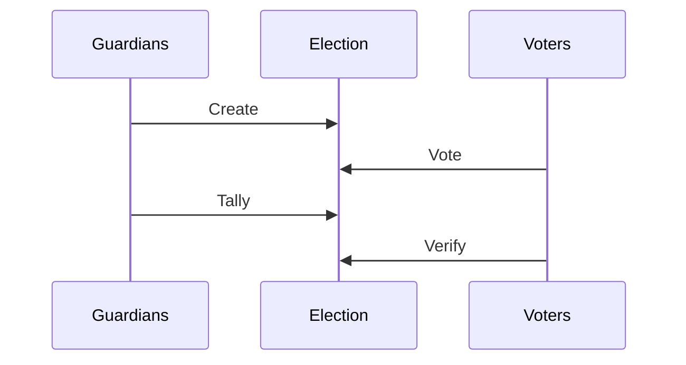

A mobile app for secure voting using the Helios protocol and INRIA’s [Belenios](https://www.belenios.org) voting library.



## Features

##### Belenios integration

- [x] Generate trustee keys on device
- [x] Encrypt Ballot on device
- [x] Tally election on device
- [ ] Verify result on device

##### Architecture

- [x] Every events must be signed by an authorized identity
- [x] Events
	- [x] Election creation. From election organizer
	- [x] Ballot emission (adding a new voter identity). From election organizer
	- [x] Ballot filling. From voter
- [X] Running a main public pod

##### UI/UX

- [ ] Resuts as a pie chart
- [ ] Inspect deroulement of an elections (how many empty/filled ballots)

##### Nice to have

- [ ] Extract rescript-belenios
- [ ] Extract rescript-sjcl

## Developer instructions

```
# Install dependencies (You need nodejs 14, use nvm if you need)
npm install
npm run re:start # or use the vscode plugin
npm run web
```

## Annotated source code

main | models
-----|-------
[Core](https://scrutin-app.github.io/scrutin/src/Core.html) | [Event](https://scrutin-app.github.io/scrutin/src/model/Event_.html)
[State](https://scrutin-app.github.io/scrutin/src/State.html) | ~~[Ballot](https://scrutin-app.github.io/scrutin/src/model/Ballot.html)~~
~~[StateEffect](https://scrutin-app.github.io/scrutin/src/StateEffect.html)~~ | ~~[Trustee](https://scrutin-app.github.io/scrutin/src/model/Trustee.html)~~
. | ~~[Identity](https://scrutin-app.github.io/scrutin/src/model/Identity.html)~~
. | ~~[Election](https://scrutin-app.github.io/scrutin/src/model/Election.html)~~


<!--
## Release
[Web demo](https://demo.scrutin.app)
[Android apk](https://expo.dev/accounts/mlalisse/projects/scrutin/builds/e6bd66f5-ce96-4dac-b874-ab2c0a1f3b1b)
-->
