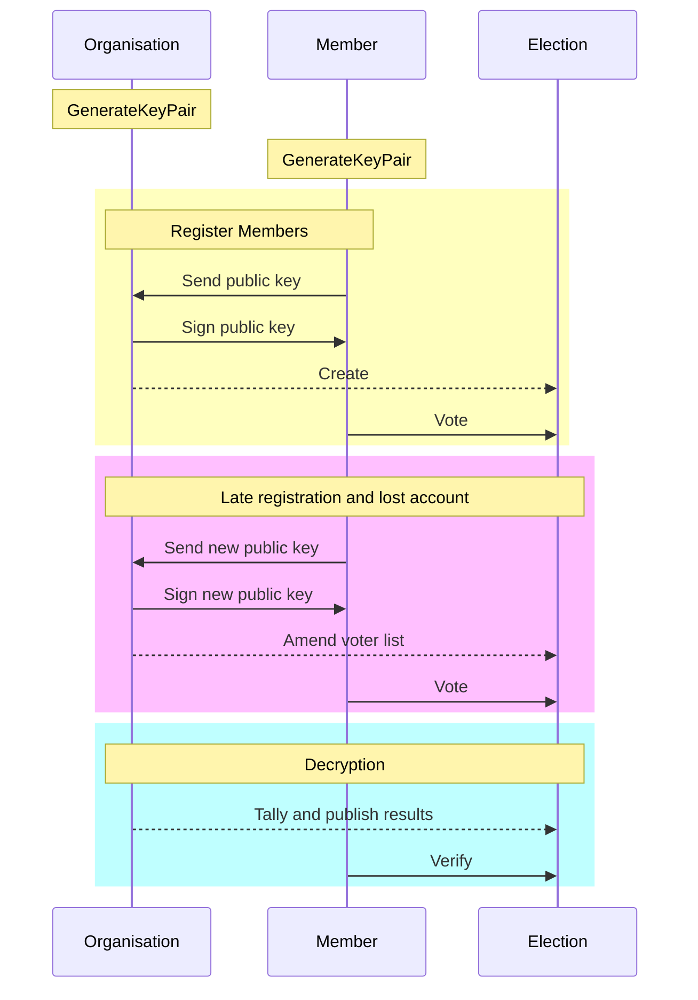

This is home of the [docco](http://ashkenas.com/docco/) docs. Published using github pages.

See [Core](https://scrutin-app.github.io/scrutin/src/Core.html) for exemple.

Should be moved out of the main branch

#### I - End-to-end encryption

**Your vote, your choice.**

Your vote is encrypted: Nobody can read the content of your vote.

#### II - Verifiability

Real-world elections tend to be opaques.
Modern digital election system aims at more transparency.

To do so, the election data, including encrypted ballots is publicly available for everyone to verify the results, through:

**Individual verifibiality**

You can verify that your vote has been taken into account.

**Universal verifibiality**

You can verify that the result is indeed the result of all the ballots.

#### III - Voting list management

**This is still a work-in-progress**

